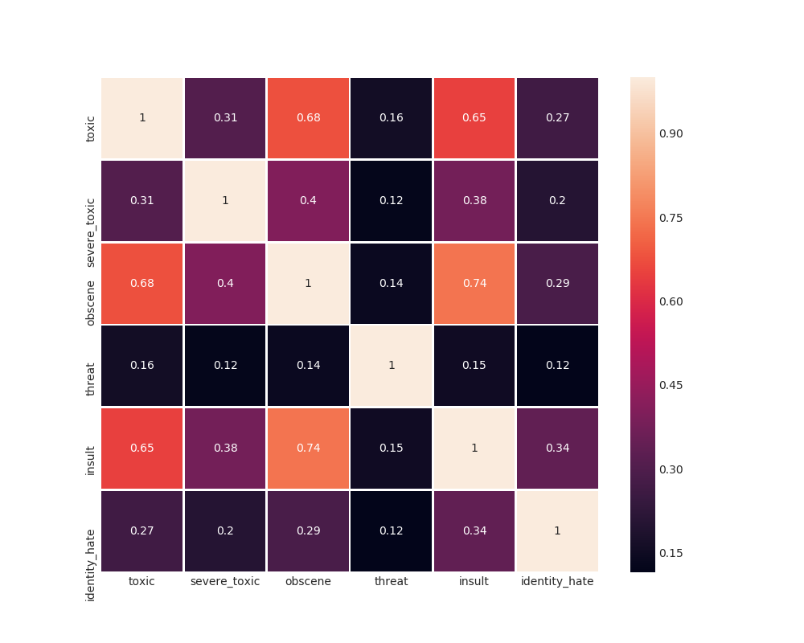
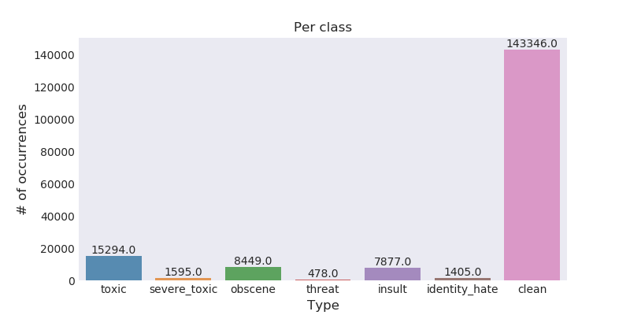
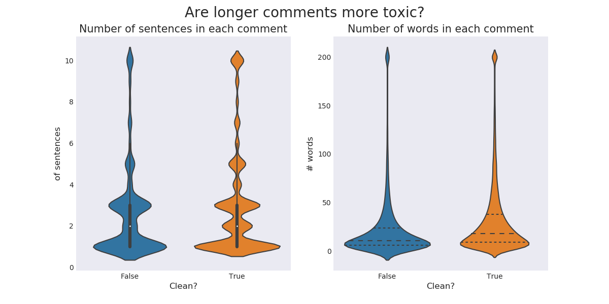
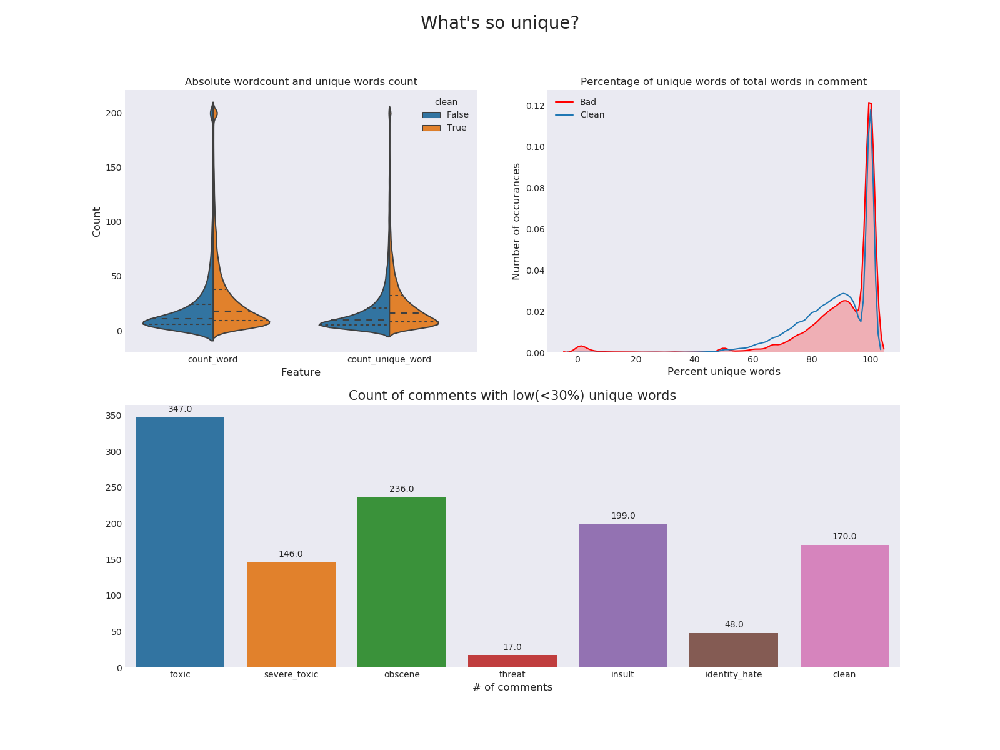
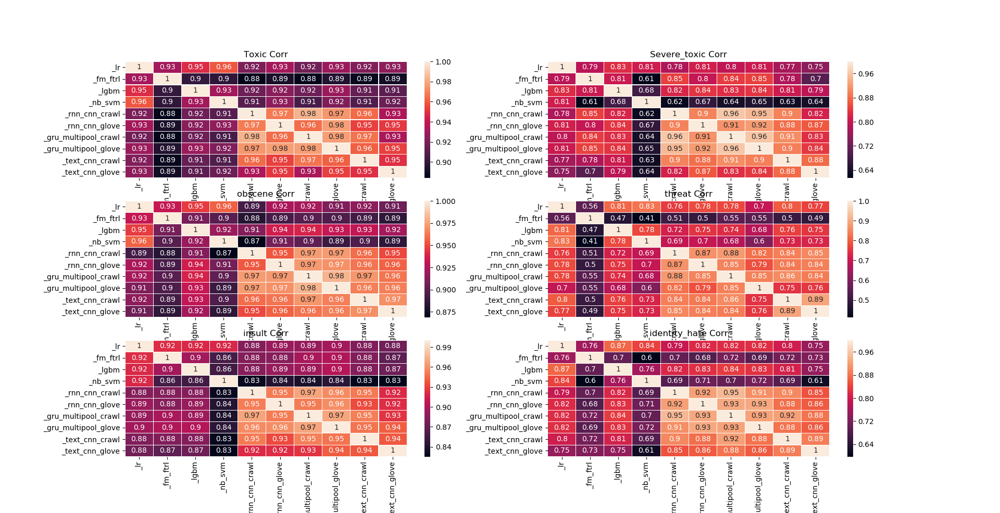

# Toxic Comment Challenge

## IDEA
选取这些comment的TF-IDF作为特征（这里选取的TF-IDF特征可以是words和chars的组合），然后对这些特征进行classify，或者结果。
这就需要考虑chars的选取的范围，由于内存的不足，我暂时先选择2-5这个范围。另外我们也需要考虑words的选取，我这里仅仅选取了
[NB-SVM strong linear baseline](https://www.kaggle.com/jhoward/nb-svm-strong-linear-baseline)当中的tokenize作为分词器，
但我认为这个分词器还是有所缺陷的。

除了使用普通的TF-IDF作为特征来训练得到classify的结果，我们还需要通过训练BI-LSTM语言模型提取语言特征进行分类训练。当中使用
[GolVe](https://nlp.stanford.edu/projects/glove/),作为我们的预训练模型这能够提高我们训练的准确率。

最后我们需要把用TF-IDF训练的Classify得到的结果和用BI-LSTM训练得到的结果进行Stacking得到最后的提交结果。

## Feature Analysis
### 1. Covariance

我们发现有以下几个是强相关的元素。
- toxic vs obscene
- toxic vs insult
- insult vs obscene

### 2. Comments distribution

我们发现大多数数据都倾斜于clean数据上面。这是极其不平衡的数据，我们需要增加一些标注数据或者复制多份数据来增加数据的数量。
其中我已经完成通过markovify来增加了标注的数据来增强TF-IDF的特征。

### 3. Number of sentences or words

其实我们并没有发现这些特征并没有区分Clean和Toxic之间的差别

### 4. Number of Unique words

我们发现clean数据中小于30%的评论数量相对其他toxic类别占比很少，我们认为他是一个比较好的特征

### 5. Number of Word Cloud

## Classifiers Compare

### Word TF-IDF with (1, 2) and util.tokenizer
| Classify Name |  AUC   |
|:-----------:|:--------:|
|   NB-SVM  |   **0.9829** |
|   LR      |   0.9820 |
|   RF    |   0.9059 |

### Word TF-IDF with (1, 2) and util.tokenize_gensim
|Classify Name |  AUC   |
|:-----------:|:--------:|
|   NB-SVM  |   0.9800 |
|   LR      |   **0.9812** |

### Word TF-IDF with (1, 2) and util.self_tokenize
| Classify Name |  AUC   |
|:-----------:|:--------:|
|   NB-SVM  |   0.9805 |
|   LR      |   **0.9815** |

### Word TF-IDF with (1, 2) ,util.self_tokenize and hstack indirect
|Classify Name |  AUC   |
|:-----------:|:--------:|
|   NB-SVM  |   **0.9562** |
|   LR      |   0.8582 |

### Word TF-IDF with (1, 2), Char TF-IDF with (1, 3) and use self.self_tokenize
|Classify Name |  AUC   |
|:-----------:|:--------:|
|   NB-SVM  |   **0.9843** |
|   LR      |   0.9824 |

### Word TF-IDF with (1, 2), Char TF-IDF with (1, 4) and use self.self_tokenize
|Classify Name |  AUC   |
|:-----------:|:--------:|
|   NB-SVM  |   **0.9842** |
|   LR      |   0.9823 |

### Word TF-IDF with (1, 2), Char TF-IDF with (1, 5) and use self.self_tokenize
|Classify Name |  AUC   |
|:-----------:|:--------:|
|   NB-SVM  |   **0.9841** |
|   LR      |   0.9822 |

在相同的word TF-IDF下，不同ngram_range值char的TF-IDF下（没有扩展评论数量和convai预测作为特征）的对比:

|Classify Name\ngram_range | (1, 2) | (1, 3) | (1, 4) | (1, 5) | (1, 6) | (2, 5) | (2, 6) |
|:-----------:|:--------:|:--------:|:----------:|:---------:|:--------:|:-------:|:-----:|
|   NB-SVM  | **0.9828+-0.0012** | **0.9833+-0.0010** | **0.9833+-0.0010** | **0.9832+-0.0010** | **0.9832+-0.0010** | **0.9833+-0.0009** | **0.9833+-0.0010** |
|   LR      | 0.9813+-0.0009 | 0.9822+-0.0008 | 0.9822+-0.0008 | 0.9822+-0.0008 | 0.9822+-0.0008 | 0.9821+-0.0007 | 0.9821+-0.0007 |

我们发现ngram_range的值为(2, 5)时，char TF-IDF特征取得的效果最好。在模型当中，我们发现NB-SVM是比较好的线性模型。

#### 采用不同特征组合训练分类器得出的AUC值，word的TF-IDF作为主要特征

| Classify Name | **word TF-IDF (1, 2) tokenize** | word TF-IDF (1, 2) tokenize_gensim | word TF-IDF (1, 2) self_tokenize | word TF-IDF (1, 2) self_tokenize hstack indirect |
|:---------:|:-------:|:-------:|:-------:|:-------:|
|   NB-SVM  | **0.9829** | 0.9800 | 0.9805 | **0.9562** |
|   LR      |   0.9820 | **0.9812** | **0.9815** | 0.8582 |

我们发现NB-SVM和LR是目前比较好的一个分类器

## Deep learning
使用GloVe和FastText的word vector来训练一下的模型：
1. BI-GRU-multi-pooling 
2. Text-CNN
3. BI-GRU-CNN-multi-pooling
使用5-fold进行训练stacking的第一层（5-fold训练并给出train的预测结果，使用全部train sample训练并预测test的预测结果）

## TODO
- [x] BI-LSTM with GloVe训练得到结果
- [x] 找出若干个较高score的classify模型作为Stacking的前模型（NB-SVM）
- [x] 找出适当的TF-IDF作为classify的特征
- [x] 通过学习conservation的数据来预测toxic_level， attack，aggression作为train数据的特征。
- [x] 加入人为特征作为训练特征（如：unique words，count sent等）**发现效果不佳**
- [x] 在进行Deep Learning训练时，需要文本预处理
- [x] stacking 所需的模型预测train结果作为第二层的训练特征
- [x] 使用各个模型单独预测test的结果作为第二层的训练特征
- [x] 使用LinearRegression作为第二层的stacking

## Stacking model:

- RNN_multipool with GloVe, Crwal pre-trained word2vec (Glove: 0.9845, Crwal: 0.9849)
- RNN_CNN with Glove, Crwal pre-trained word2vec 
- TextCNN model with Glove, Crwal pre-trained word2vec (Glove: 0.9812, Crwal: 0.9832)
- LR model with (1, 2) words TF-IDF and (2, 6) chars TF-IDF (0.9792)
- LGM model with (1, 2) words TF-IDF, (1, 1) chars TF-IDF and some number features (0.9793)
- NB-SVM model with (1, 2) words TF-IDF and the comments is extends with macdiffy (0.9781)
- FM-FTRL model with (1, 2) words TF-IDF, (1, 3) chars TF-IDF and some number features

### Full AUC score

| pre_trained w2v\ model | RNN_multipool | RNN_CNN   | TextCNN    |
|:----------------------:|:-------------:|:---------:|:----------:|
|      GloVe 300d        |   0.9883014   | 0.9879838 | 0.98492758 |
|      Crawl 300d        |   0.9879363   | 0.9875587 | 0.98714017 |

|    LR     |    LGM    | NB-SVM-extend |  FM-FTRL  |
|:---------:|:---------:|:-------------:|:---------:|
| 0.9857099 | 0.9776384 |   0.9827985   | 0.9871310 |

### Stacking AUC score of different models

|                  |  toxic         |   severe_toxic |     obscene    |    threat      |    insult      | identity_hate  | AVG | 
|:----------------:|:--------------:|:--------------:|:--------------:|:--------------:|:--------------:|:--------------:|:-------|
|   LR             |  0.97903702    | 0.98840895     | 0.99045866     | **0.99045458** | **0.98299227** | **0.98290816** | 0.97763844 |
|  FM-FTRL         | **0.98072929** | **0.99025783** | **0.99303134** | **0.99000524** | **0.98527589** | **0.98348643** | 0.98713100 |
|  LGBM (500 round)| 0.97633961     | 0.98752264     | 0.99091282     | 0.95177009     | 0.98014505     | 0.97914046     | 0.97763844 |
| LGBM (1000 round)| 0.97758161     | 0.98797328     | 0.99154957     | 0.98481744     | 0.98137710     | 0.97940613     | 0.98378419 |
| NB-SVM extend    | 0.97941723     | 0.98460792     | 0.98909591     | **0.98820726** | 0.98128242     | 0.97418084     | 0.98279859 |
| RNN_MP (GloVe)   | **0.98350626** | 0.99025138     | 0.99264857     | 0.98716431     | **0.98782011** | **0.98841825** | **0.98830148** |
| RNN_MP (Crawl)   | 0.98312482     | **0.99050587** | **0.99282296** | 0.98585167     | 0.98762124     | 0.98769136     | 0.98793632 |
| RNN-CNN (GloVe)  | 0.98288402     | **0.99079432** | 0.99256340     | **0.98741477** | **0.98736435** | **0.98688196** | 0.98798380 |
| RNN-CNN (Crawl)  | **0.98332027** | 0.98989485     | **0.99266605** | 0.98547506     | 0.98734830     | 0.98664816     | 0.98755878 |
| Text-CNN (GloVe) | 0.97943479     | 0.98662176     | 0.99146882     | 0.98242349     | 0.98581685     | 0.98379977     | 0.98492758 |
| Text-CNN (Crawl) | **0.98063669** | **0.98909897** | **0.99153136** | **0.98896803** | **0.98642427** | **0.98618172** | 0.98714017 |

- Toxic: RNN_MP(GloVe), RNN-CNN(Crawl), FM-FTRL, Text-CNN(Crawl)
- Severe Toxic: RNN-CNN(GloVe), RNN_MP(Crawl), FM-FTRL, Text-CNN(Crawl)
- Obscene: FM-FTRL, RNN-CNN(Crawl), RNN_MP(Crawl), Text-CNN(Crawl)
- Threat: LR, FM-FTRL, NB-SVM, Text-CNN(Crawl), RNN-CNN(GloVE)
- Insult: RNN_MP(GloVe), RNN_CNN(GloVe), Text-CNN(Crawl), FM-FTRL, LR
- Identity_hate: RNN_MP(GloVe), RNN-CNN(GloVe), Text-CNN(Crawl), FM-FTRL, LR

### The predict result of different models

